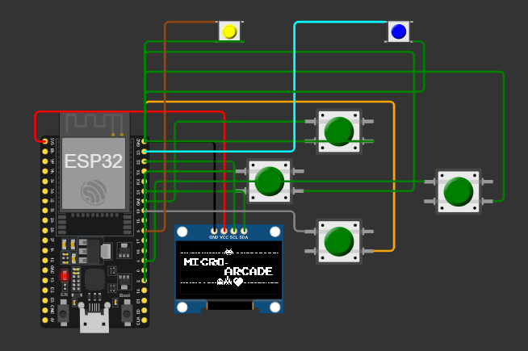

# ESP32 Menu and Games Project

This repository contains firmware for an ESP32 development board using the Arduino framework and PlatformIO. The project drives a 128x64 OLED display and reads input from a set of buttons to present a simple menu system and run games like Pong and Snake.

## Structure

```
CMakeLists.txt
platformio.ini
include/
lib/
src/
  core/
    app.cpp
    app.h
    input.cpp
    input.h
    states_displays.cpp
    states_displays.h
  games/
    Snake.cpp
    Snake.h
  main.cpp (removed during build)
test/
  README
```

- **core/**: core application logic, display helpers, and input handling.
- **games/**: individual game implementations (currently Snake, with placeholders for Pong etc.).
- **platformio.ini**: configuration for building with PlatformIO targeting an ESP32.
- **CMakeLists.txt**: present due to PlatformIO, but PlatformIO handles build steps.

## Hardware Setup

### Circuit Diagram



The project is designed to work with:
- **ESP32 Development Board**
- **128x64 I2C OLED Display** (address: 0x3C)
- **6 Push Buttons** for user input

### Button Pin Configuration

The input buttons are mapped to the following ESP32 GPIO pins (defined in `input.cpp`):

| Button   | GPIO Pin |
|----------|----------|
| Up       | 2        |
| Down     | 19       |
| Right    | 4        |
| Left     | 16       |
| Select   | 5        |
| Back     | 23       |

All buttons use **INPUT_PULLUP** mode and are active low (triggered when pulled to ground).

## Features

- OLED display initialization and drawing routines (using Adafruit SSD1306/GFX).
- Button input abstraction through the `Input` class supporting six buttons (up, down, left, right, select, back).
- Menu navigation logic with states for initialization, main menu, settings, and game modes.
- Snake game implementation with movement, food generation, and screen wrapping.

## Building and Uploading

1. Install PlatformIO and the Espressif 32 platform.
2. Connect an ESP32 board to your computer.
3. Run:
   ```sh
   platformio run --target upload
   ```
   from the project root.

The firmware will compile and flash to the connected board.

## Notes

- The `main.cpp` file is intentionally removed as the Arduino entry points are defined in `app.cpp`.
- Paths in game headers use relative includes to locate core headers.
- To add new games, create new files under `src/games/` and update the menu logic in `app.cpp`.

## Testing & Simulation

This project is tested and validated on both:

- **Physical Hardware**: Real ESP32 board connected to actual OLED display and buttons.
- **WOKWI Platform**: Online simulation environment (https://wokwi.com) for virtual prototyping and testing without physical components.

The circuit diagram above reflects the hardware configuration used in both environments.

## License

This project is provided as-is for educational purposes. Feel free to modify and redistribute under the terms of your choosing.